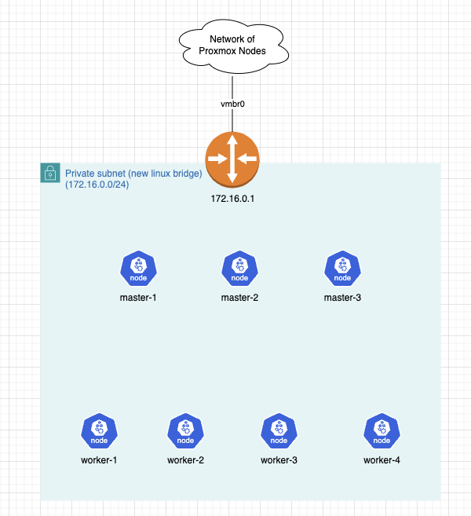

# proxmox-k8s-manager

Create your homelab k8s cluster in Proxmox with ease.

## Overview

This tool uses `ansible` & `cloud-init` to initialize a kubeadm cluster in Proxmox.

By default, it will create a cluster with this structure:



- 3 master nodes, 4 worker nodes
- network range of 172.16.0.0/24
- FRR router node for routing & DHCP & DNAT/SNAT

## Usage

```shell
pkm start --port 8080 // start server default at port 8080
```

After the server starts, visit `http://{PROXMOX_LOCATION}:8080`.